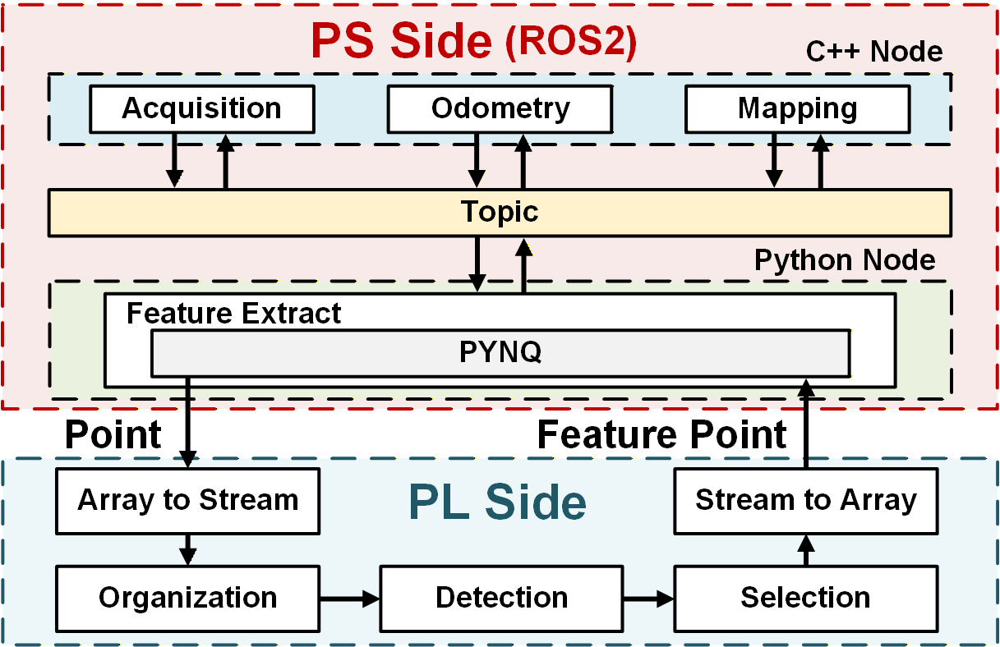

# ROS-PYNQ Co-design Framework for SLAM Acceleration

[](https://docs.ros.org/en/humble/)
[](http://www.pynq.io/)
[](https://www.xilinx.com/products/som/kria/kv260-vision-starter-kit.html)
[](LICENSE)

**A ROS-PYNQ hardware-software co-design framework and FPGA-based feature extraction accelerator for LIO-SAM.**

> **Paper Title:** A ROS-PYNQ Co-design Framework and Feature Extraction Accelerator for SLAM Acceleration  
> **Authors:** Ming Xia, Zhao Cang, Haocheng Li, Ziyuan Pu, He Li  
> **Affiliation:** Southeast University, Nanjing, China

---
## Introduction

Real-time LiDAR SLAM on edge devices is often bottlenecked by computationally intensive feature extraction. This repository implements a novel **ROS-PYNQ co-design framework** that bridges the gap between hardware logic and robotic software.

To address the computational challenge, we propose a specialized **FPGA accelerator** that maximizes parallelism by integrating a **LiDAR Angle Look-Up Table (LUT)** for rapid coordinate mapping and a **Condition-Priority Queue** for efficient, pipelined feature selection.

## System Architecture

The system tightly integrates the Processing System (PS) and Programmable Logic (PL) using a hybrid node structure:

<p align="center">
  
</p>

* **PS Side (ROS2 & PYNQ):**
    * **C++ Nodes:** Handle time-critical tasks (Acquisition, Odometry, Mapping).
    * **Python Nodes:** Act as a bridge, utilizing PYNQ to offload feature extraction to the FPGA.
* **PL Side (FPGA Accelerator):**
    * **Organization:** Projects raw data using a LiDAR-specific angle LUT.
    * **Detection:** Streams processing using cyclic buffers and comparators.
    * **Selection:** Uses a condition-priority queue to filter high-quality features.

## Prerequisites

### Hardware
* **Platform:** AMD Kria KV260 Vision AI Starter Kit.
* **Sensor:** LiDAR (Tested with KITTI Dataset).

### Software Environment
* **OS:** Ubuntu 22.04 LTS.
* **Middleware:** ROS2 Humble.
* **FPGA Toolchain:** Vitis 2024.2 / Vivado.
* **Python Framework:** PYNQ.

## Installation

1.  **Clone the repository:**
    ```bash
    git clone https://github.com/ThisIsxm/ROS-PYNQ-LIO-SAM.git
    ```

2.  **Build:**
    ```bash
    cd ROS-PYNQ-LIO-SAM/software
    colcon build --merge-install
    ```

## Usage

1.  **Launch the System:**
    ```bash
    source install/setup.bash
    ros2 launch lio_sam lo_sam_vlp16.launch.py
    ```
